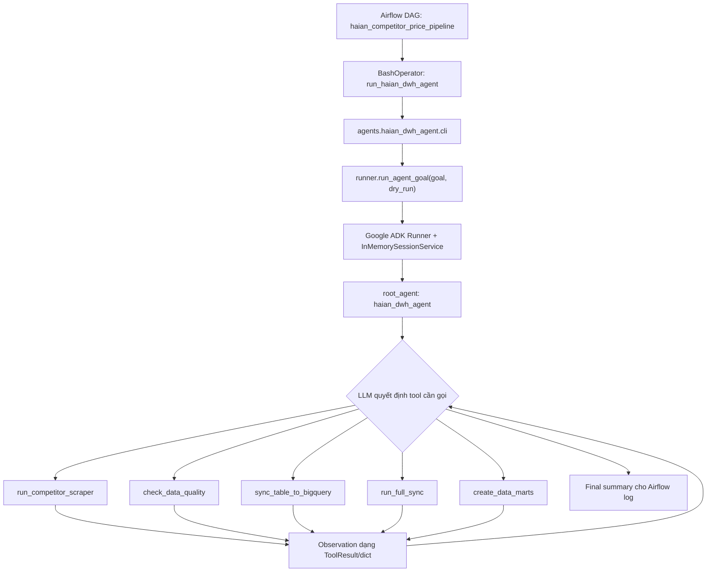
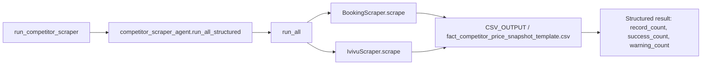
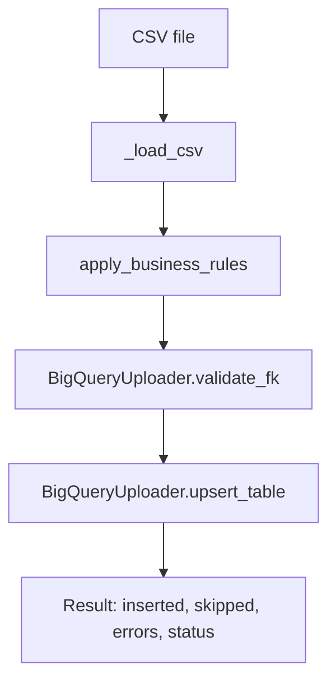
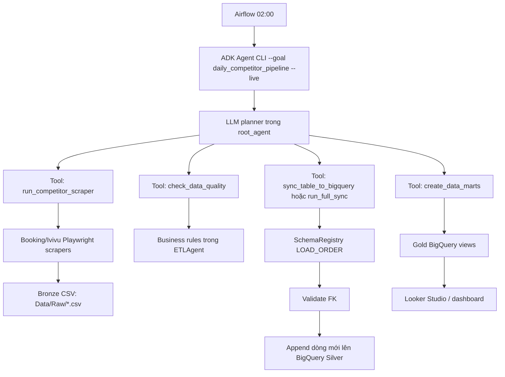

# Flow hiện tại của dự án ETL-Datawarehouse

Tài liệu này mô tả trạng thái hiện tại của workspace tại thời điểm viết: dự án đã có lớp `haian_dwh_agent` dùng Google ADK để điều phối pipeline, trong khi các script ETL/scraper cũ vẫn được giữ làm primitive tool và rollback path.

## 1. Mục tiêu hệ thống

`ETL-Datawarehouse` là pipeline dữ liệu cho Khách sạn Hải An. Hệ thống thu thập giá phòng đối thủ từ OTA, chuẩn hóa dữ liệu thành CSV, kiểm tra chất lượng, nạp lên BigQuery và tạo các view Gold phục vụ phân tích KPI như ProfitPAR, RevPAR, ADR và chỉ số giá Hải An so với thị trường.

Kiến trúc dữ liệu đi theo Medallion Architecture:

- Bronze: dữ liệu scrape/CSV thô đã được chuẩn hóa format.
- Silver: bảng BigQuery đã qua kiểm tra schema, business rule và foreign key.
- Gold: BigQuery views/data marts phục vụ dashboard và phân tích.

## 2. Flow chạy hằng ngày hiện tại

Entry point runtime hiện tại là Airflow DAG `haian_competitor_price_pipeline` trong `dags/haian_pipeline_dag.py`.

DAG chạy hằng ngày lúc `02:00`, retry tối đa 3 lần, mỗi lần cách nhau 15 phút. Thay vì còn chạy 2 task cũ `competitor_scraper_agent.py --run-now` rồi `etl_agent.py --run-now`, DAG hiện gọi một agent task:

```bash
cd /opt/airflow && python -m agents.haian_dwh_agent.cli --goal daily_competitor_pipeline --live
```

Luồng runtime:



Điểm quan trọng: Airflow hiện chỉ đóng vai trò scheduler và process launcher. Logic quyết định thứ tự hành động được đẩy vào ADK agent.

## 3. Lớp Agent

Package agent nằm ở `agents/haian_dwh_agent/`.

### `agent.py`

`agent.py` định nghĩa `root_agent` bằng `google.adk.agents.Agent`.

Agent dùng model từ biến môi trường:

```text
AGENT_MODEL=gemini-2.0-flash
```

Instruction hiện tại yêu cầu agent:

- Giữ dữ liệu BigQuery đúng, đủ và mới.
- Chỉ hành động thông qua deterministic tools.
- Không tự ý drop/delete/truncate/overwrite BigQuery table.
- Không bịa table name; chỉ dùng table/CSV đã đăng ký.
- Nếu data quality lỗi thì dừng upload bảng đó và khuyến nghị sửa CSV nguồn.
- Nếu foreign key lỗi thì ưu tiên sync dimension liên quan khi có CSV tương ứng.
- Chỉ tạo data mart sau khi Silver sync không có lỗi chặn.
- Nếu cùng một tool fail 2 lần thì dừng và tóm tắt blocker.

### `cli.py`

`cli.py` là entry point CLI cho agent:

```bash
python -m agents.haian_dwh_agent.cli --goal daily_competitor_pipeline --dry-run
python -m agents.haian_dwh_agent.cli --goal daily_competitor_pipeline --live
```

Mặc định dry-run lấy từ:

```text
AGENT_DEFAULT_DRY_RUN=true
```

Nếu truyền `--live`, tool được gọi với `dry_run=False`, tức có thể scrape thật, upload BigQuery và tạo mart thật.

### `runner.py`

`runner.py` tạo:

- `InMemorySessionService`
- ADK `Runner`
- Prompt dạng: `Run goal: <goal>. dry_run=<true|false>. Plan first, call only needed tools, observe results, then summarize final status.`

Runner lắng nghe event stream từ ADK và trả lại final text cuối cùng để in ra log.

### `models.py`

`models.py` định nghĩa contract chung cho tool và state:

- `AgentGoal`: `daily_competitor_pipeline`, `full_sync`, `check_health`, `repair_table`
- `ToolResult`: output chuẩn gồm `tool`, `status`, `summary`, `data`, `errors`, `next_recommendations`
- `TableSyncRequest`: request sync một bảng/CSV
- `AgentRunState`: state giới hạn số action bằng `max_actions`

Hiện tại `ToolResult` đã được tool facade dùng trực tiếp. `AgentRunState` là nền cho guardrail action budget, nhưng chưa thấy được nối sâu vào runner trong flow hiện tại.

## 4. Tool layer mà agent có thể gọi

Tool facade nằm ở `agents/haian_dwh_agent/tools.py`. Đây là lớp chuyển các script hiện có thành callable tools cho agent.

### `run_competitor_scraper(dry_run=True)`

Tool này gọi `agents.competitor_scraper_agent.run_all_structured`.

Flow bên dưới:



`run_all()` tự chọn ngày bằng `build_peak_dates()` nếu không truyền `checkin_dates`. Scraper ghi record tăng dần xuống CSV ở tầng Bronze. Sau khi scrape xong, script không tự gọi ETL nữa; việc tiếp theo do Airflow/agent quyết định.

### `check_data_quality(table_name, csv_filename)`

Tool này:

1. Đọc CSV từ `CSV_DATA_DIR`.
2. Khởi tạo `ETLAgent`.
3. Gọi `ETLAgent.apply_business_rules(table_name, df)`.
4. Trả về structured result với số lỗi và danh sách lỗi.

Các business rule chính nằm trong `agents/etl_agent.py`:

- Ép số âm về 0 cho các cột tiền như revenue, cost, price, amount, profit.
- Nếu `rooms_sold = 0` nhưng revenue > 0 thì đánh lỗi.
- Nếu `sellable_rooms > 212` thì đánh lỗi vượt giới hạn vật lý khách sạn.
- Nếu `rooms_sold > total_rooms_available` thì đánh lỗi overbooking/sai số liệu.
- Nếu có dòng lỗi nghiêm trọng, dòng đó bị loại khỏi DataFrame trước khi upload.
- Nếu cấu hình email đầy đủ, hệ thống gửi alert qua SMTP.

### `sync_table_to_bigquery(csv_filename, dry_run=True)`

Tool này sync một CSV cụ thể:

1. Tạo `ETLAgent`.
2. Tìm CSV trong `agent.csv_dir`.
3. Map `csv_filename` sang table bằng `SchemaRegistry.csv_to_table`.
4. Gọi `_sync_one_table(table_name, csv_path, dry_run)`.

Pipeline một bảng:



### `run_full_sync(dry_run=True)`

Tool này gọi `ETLAgent.run_full_sync()`.

`run_full_sync()` chạy qua `SchemaRegistry.LOAD_ORDER`:

1. `dim_date`
2. `dim_hotel`
3. `dim_room_type`
4. `dim_channel`
5. `dim_guest_segment`
6. `dim_cost_category`
7. `dim_promotion`
8. `fact_booking`
9. `fact_room_inventory_daily`
10. `fact_room_cost_daily`
11. `fact_room_revenue_daily`
12. `fact_distribution_cost_daily`
13. `fact_guest_review`
14. `fact_competitor_price_snapshot_template`
15. `kpi_monthly_summary`
16. `qa_checks_summary`

Mục tiêu của order này là load dimension trước fact để giảm lỗi foreign key.

### `create_data_marts(dry_run=True)`

Tool này gọi `agents.create_data_marts.create_marts()`.

`create_marts()` tạo 4 BigQuery views:

- `mart_cost_analysis_daily`
- `mart_profitpar_daily`
- `mart_competitor_pricing_summary`
- `mart_haian_vs_market_price`

Config hiện lấy từ environment:

```text
GCP_PROJECT_ID
BQ_DATASET_ID
GOOGLE_CREDENTIALS_PATH
```

Trong dry-run, function chỉ trả metadata `project_id`, `dataset_id`, `view_count=4`, không gọi BigQuery.

Trong live mode, function tạo BigQuery client bằng service account rồi chạy SQL. Riêng `mart_profitpar_daily` có bước:

```sql
DROP TABLE IF EXISTS `<project>.<dataset>.mart_profitpar_daily`
```

Sau đó mới `CREATE OR REPLACE VIEW`. Đây là behavior cần lưu ý vì nó có thao tác drop object nếu mart cũ là physical table.

## 5. ETL core

ETL core nằm ở `agents/etl_agent.py`.

### `SchemaRegistry`

`SchemaRegistry` là registry trung tâm:

- `LOAD_ORDER`: thứ tự nạp dependency.
- `CSV_TO_TABLE`: map CSV stem sang BigQuery table.
- `PRIMARY_KEYS`: khóa chính cho từng table.
- `FOREIGN_KEYS`: quan hệ FK để validate trước upload.
- `infer_bq_schema()`: suy luận schema BigQuery từ pandas DataFrame.

### `BigQueryUploader`

`BigQueryUploader` quản lý:

- Lazy BigQuery client.
- Tạo dataset nếu chưa có.
- Kiểm tra table tồn tại.
- Lấy primary key hiện có.
- Validate FK bằng cache hoặc query BigQuery.
- Insert dòng mới bằng `load_table_from_dataframe`.

Lưu ý: tên `upsert_table()` hiện thiên về append dòng mới theo primary key. Nó bỏ qua dòng đã tồn tại, chưa phải merge/update đầy đủ theo nghĩa update record cũ.

### `ETLAgent`

`ETLAgent` là orchestrator ETL truyền thống, vẫn được tool layer gọi lại.

Nó đọc config từ `.env`:

- `GCP_PROJECT_ID`
- `BQ_DATASET_ID`
- `GOOGLE_CREDENTIALS_PATH`
- `CSV_DATA_DIR`
- `FULL_SYNC_TIME`
- `LOG_FILE`
- `LOG_LEVEL`
- SMTP alert variables

Các mode CLI cũ vẫn còn:

```bash
python agents/etl_agent.py --run-now
python agents/etl_agent.py --dry-run
python agents/etl_agent.py --test-connection
python agents/etl_agent.py --file fact_booking.csv
```

Đây là rollback/debug path tốt nếu agent layer gặp lỗi.

## 6. Scraper flow

Scraper nằm ở `scrapers/` và orchestrator nằm ở `agents/competitor_scraper_agent.py`.

### Shared scraper base

`scrapers/base.py` cung cấp:

- `HotelDimensionManager`: map tên khách sạn sang `hotel_id`, tự bổ sung khách sạn mới vào dimension.
- `make_record()`: tạo snapshot record đúng schema.
- `parse_price()`: chuẩn hóa chuỗi giá.
- `map_room_type()`: map loại phòng raw về room type.
- `setup_browser()`: cấu hình Chromium/Playwright.
- `build_peak_dates()`: tạo danh sách ngày cao điểm.
- `write_records()`: ghi CSV an toàn.

### OTA scrapers

Hiện có:

- `scrapers/booking_scraper.py`: scrape Booking.com bằng Playwright.
- `scrapers/ivivu_scraper.py`: scrape Ivivu bằng Playwright và BeautifulSoup.

`competitor_scraper_agent.run_all()` chạy Booking trước, rồi Ivivu, gom record và in summary theo `scrape_status`.

## 7. Data flow end-to-end



## 8. Runtime Docker/Airflow

`Dockerfile` build image từ `apache/airflow:2.10.0-python3.10`, cài:

- dependencies trong `agents/requirements.txt`
- Playwright
- Chromium dependencies/browser

`docker-compose.yml` chạy service `airflow-standalone`:

- Port `8080:8080`
- Mount `./dags`, `./agents`, `./scrapers`, `./Data`
- Load env từ `./agents/.env`
- Override path trong container:
  - `CSV_DATA_DIR=/opt/airflow/Data/Raw`
  - `GOOGLE_CREDENTIALS_PATH=/opt/airflow/agents/haian-dwh-project-3ded89ea6dc8.json`
  - `LOG_FILE=/opt/airflow/agents/logs/etl_agent.log`
  - `PYTHONPATH=/opt/airflow`
- Dùng `SequentialExecutor` và SQLite, phù hợp local/demo hơn production parallel workload.

## 9. Test hiện có

Test suite mới nằm ở `tests/`:

- `tests/test_agent_models.py`: kiểm tra contract `ToolResult` và `AgentRunState`.
- `tests/test_agent_tools.py`: kiểm tra tool facade cho DQ và full sync bằng monkeypatch.
- `tests/test_create_data_marts.py`: kiểm tra `create_marts(dry_run=True)` dùng env config và không gọi BigQuery.

Ngoài ra vẫn còn `agents/test_dq.py`, nhưng file này là script manual, không phải pytest suite chính.

Lệnh test kỳ vọng:

```bash
pytest tests -q
```

## 10. Các điểm cần lưu ý trong flow hiện tại

- DAG hiện đã phụ thuộc vào package `agents.haian_dwh_agent`. Nếu package hoặc ADK dependency lỗi, DAG sẽ fail ở task agent.
- `InMemorySessionService` nghĩa là agent không có memory bền vững giữa các lần chạy.
- `AgentRunState.max_actions` đã có trong model nhưng chưa thấy được enforce trực tiếp trong runner.
- `create_data_marts()` live mode vẫn có `DROP TABLE IF EXISTS` cho `mart_profitpar_daily`; cần cân nhắc nếu production không muốn drop object.
- `BigQueryUploader.upsert_table()` hiện chỉ append dòng mới theo PK, không update dòng cũ.
- `run_full_sync()` vẫn nạp theo `LOAD_ORDER` cố định; agent có thể chọn tool, nhưng logic bên trong ETL core vẫn deterministic.
- Airflow đang dùng `SequentialExecutor` và SQLite, nên phù hợp môi trường local/demo hơn production chịu tải.

## 11. Rollback path

Nếu agent layer lỗi, `dags/haian_pipeline_dag.py` đã ghi sẵn rollback commands:

```bash
python /opt/airflow/agents/competitor_scraper_agent.py --run-now
python /opt/airflow/agents/etl_agent.py --run-now
```

Rollback hợp lý là đổi DAG về 2 `BashOperator` cũ:

```text
run_competitor_scraper -> run_etl_to_bigquery
```

Khi đó hệ thống quay lại automation flow truyền thống: scrape trước, ETL sau, không đi qua ADK agent.
